# otus-task7

# Работа с загрузчиком

1. Попасть в систему без пароля несколькими способами;
2. Установить систему с LVM, после чего переименовать VG;
3. Добавить модуль в initrd

Для выполнения задания создадим виртуальную машину в Virtualbox. \
Я буду использовать ВМ с ОС AlmaLinux 9.
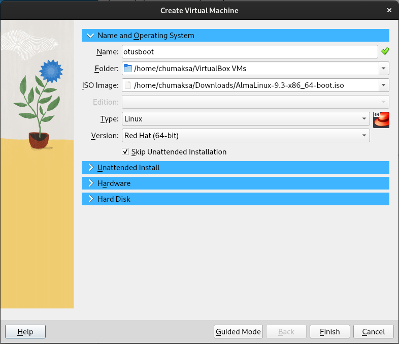
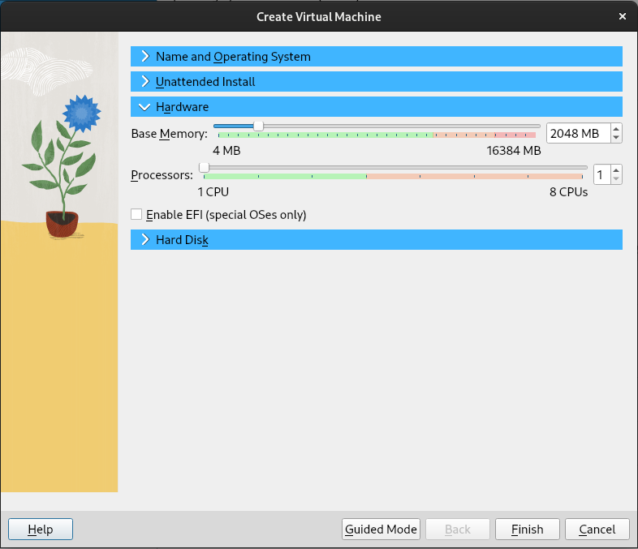
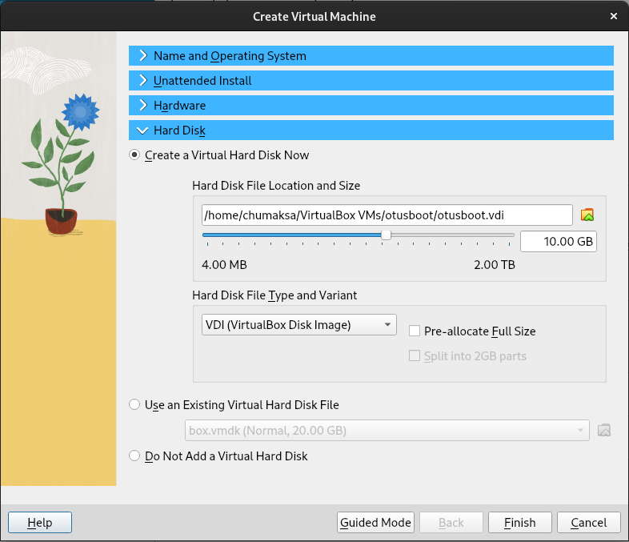

При установке был выбран пункт минимальной инсталляции и отключен root. Остальное всё по умолчанию. \
AlmaLinux 9 по умолчанию устанавливается на LVM. Это позволит нам выполнить второй пункт задания.

## 1. Попасть в систему без пароля несколькими способами

### Решение

После окончания установки и перезагрузки системы жмём клавишу 'Shift' для отображения меню загрузчика Grub.
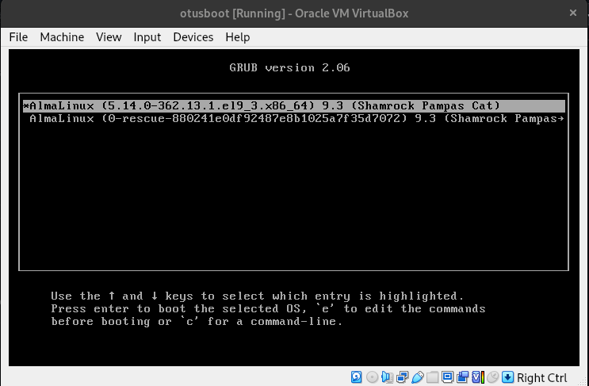

Чтобы изменить параметры загрузки нажимаем клавишу 'e'
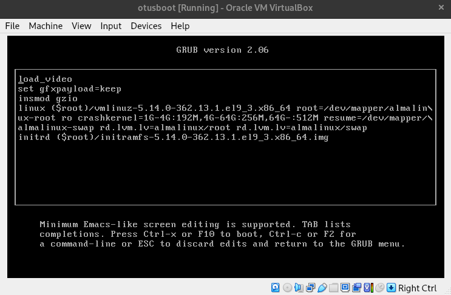

#### Способ 1. init=/bin/bash

В конце строки, которая начинается на 'linux', добавляем init=/bin/bash. \
В этой же строке находим параметр 'ro' и меняем его на 'rw'. 
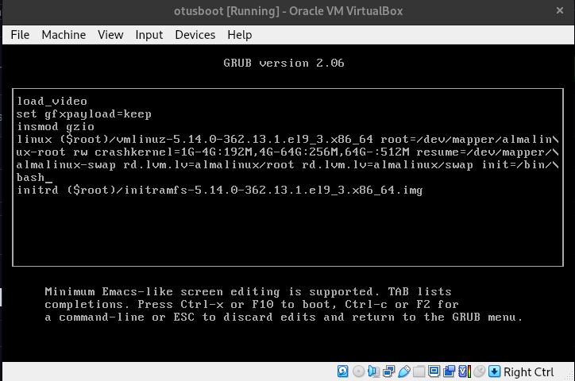

Далее жмём 'Ctrl-x' для загрузки с новыми параметрами.
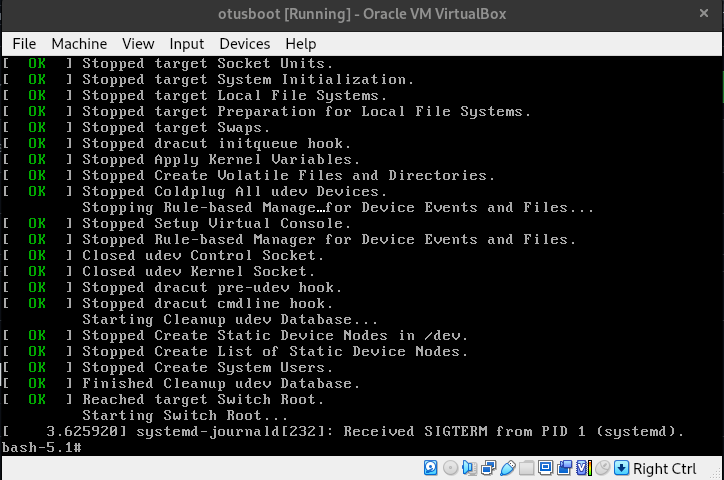

Проверим, что файловая система доступна для записи. \
Для этого создадим каталог 'test' в корне.
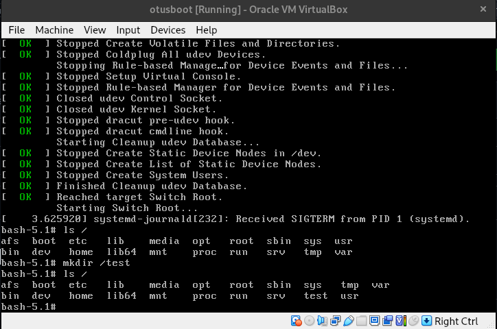

#### Способ 2. rd.break

В строке начинающейся с 'linux' меняем параметр 'ro' на 'rw' и в конце строки добавляем rd.break. \
Далее жмём 'Ctrl-x' и попадаем в emergency mode.
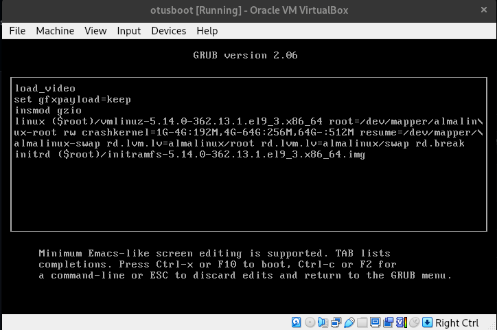
Наша файловая системе доступна для чтения и записи через /sysroot. \
Можем изменить корневую систему и затем поменять пароль для пользователя.
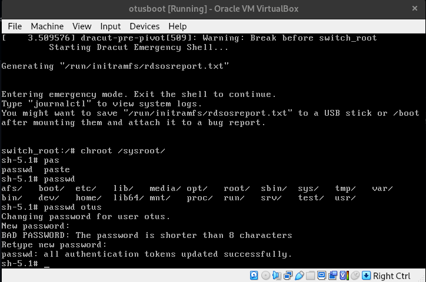
Если в системе был включен Selinux, то нужно заставить его перечитать контексты - touch /.autorelabel

## 2. Установить систему с LVM, после чего переименовать VG

Наша VG называется almalinux. \
Переименуем с помощью команды vgrename almalinux otusroot
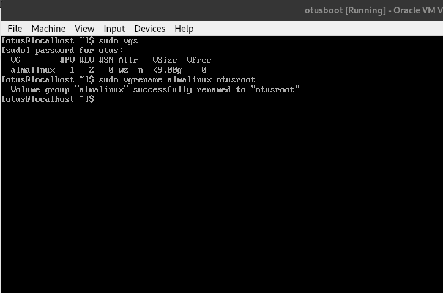

Далее в файлах /etc/fstab, /etc/default/grub, /boot/grub2/grub.cfg меняем старое название нановое. \
Пересоздаем initrd image, чтобы он знал новое название Volume Group. (dracut -f -v)
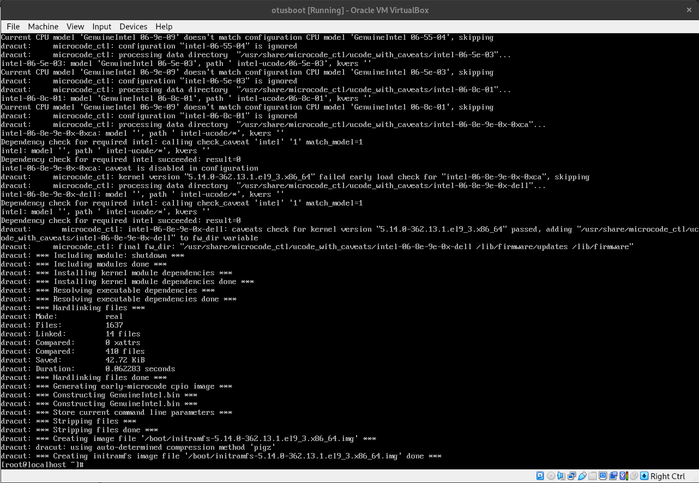

Перезагружаеся и проверяем. Система загрузилась, название VG изменилось успешно.
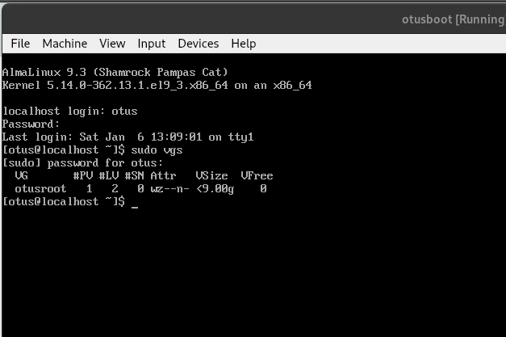

## 3. Добавить модуль в initrd

Скрипты модулей хранятся в каталоге /usr/lib/dracut/modules.d/. Создадим там папку с именем 01test. \
Далее скопируем туда два скрипта из задания и пересоберём initrd (dracut -f -v), так как делали раньше. \
Проверим какие модули буду загружены и найдём наш.
```

[root@otus 01test]# lsinitrd -m /boot/initramfs-$(uname -r).img | grep test
test
```

Перезагружаемся и видим нашего пингвина. Модуль успешно добавлен.
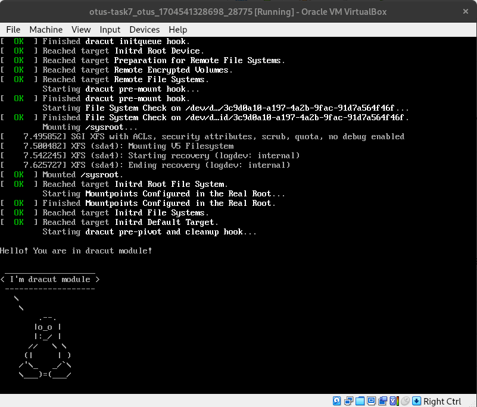


